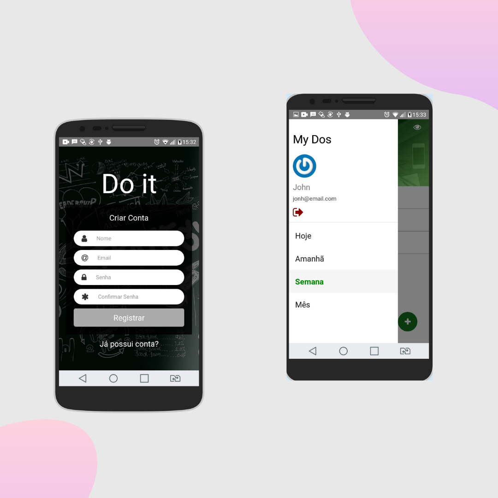
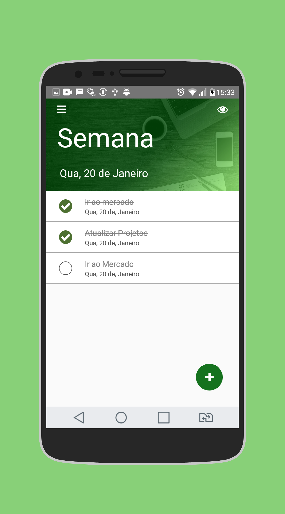

# Tasks Project

Projeto Tasks, realizado junto às aulas do curso [React Native: Desenvolva APPs Nativas para Android e iOS
](https://www.udemy.com/course/curso-react-native/)


## Objetivo do Projeto
O aplicativo tem como objetivo adicionar tarefas em uma data estimada específica, escolhida pelo usuário, bem como excuí-la.

A aplicação foi integrada com uma REST API, criada durante o curso, bem como banco de dados PostgreSQL, onde foi armazenado as tasks adicionadas e informações de usuário.

## Preview


</br></br>

</br></br>

</br></br>



### Como iniciar essa aplicação:
```
git clone https://github.com/alanhcrdz/tasks
```

```
npm install
```

```
react-native run
```
obs.: necessário realizar configurações de acordo com seu OS


